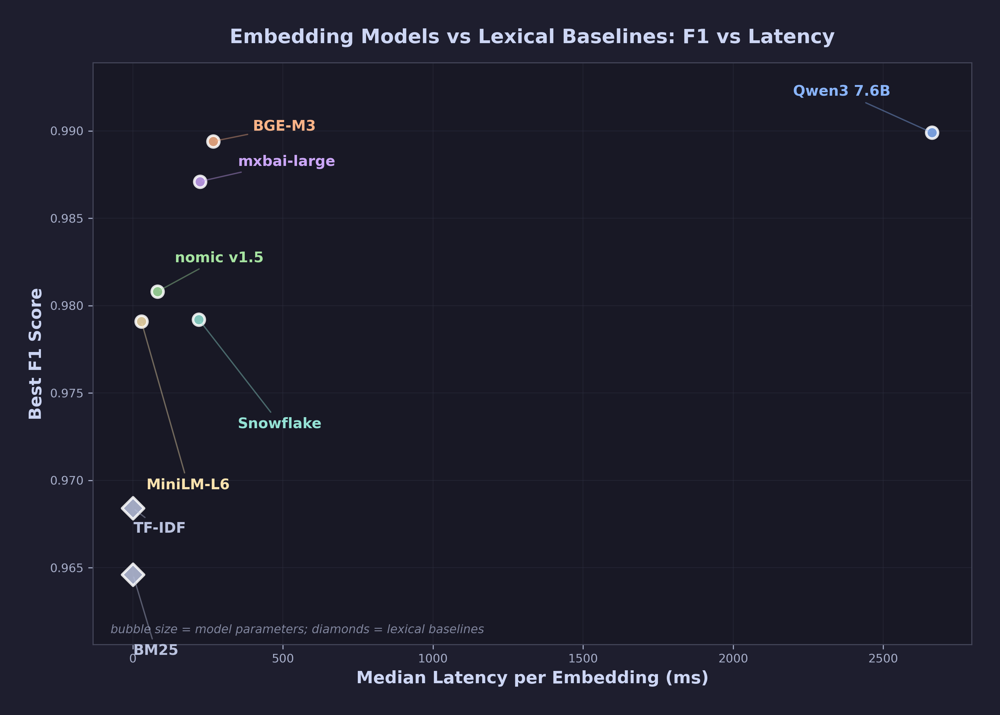

# Embedding Models for Bug Report Deduplication

I benchmarked 6 self-hosted embedding models for duplicate bug report detection. 650 bug reports (including 250 real SDK captures via Playwright), 4,475 labeled pairs. All models run locally via [Ollama](https://ollama.com/) on a single CPU server (€25/mo). No data leaves your network.

**Full write-up:** [How I Chose an Embedding Model for Bug Report Deduplication](https://dev.to/bugspotter/embedding-models-bug-dedup)



## Key Findings

- **The top 3 models are statistically tied.** qwen3 (CV F1=0.989), bge-m3 (0.988), and mxbai (0.986) have overlapping bootstrap 95% CIs — you can't pick a winner from F1 alone. Pick on latency, hard-negative errors, and pgvector compatibility.
- **Threshold 0.9 is a trap.** At cosine ≥ 0.9, recall drops to 22–58%. Optimal thresholds range from 0.65 to 0.74, different for every model. Note: thresholds were tuned on the evaluation set — use them as starting points, not production values.
- **Machine-captured metadata > human descriptions.** Console errors, network logs, and stack traces improved F1 from 0.951 to 0.990.
- **Well-tuned BM25 is closer than folklore suggests — and on Bugzilla it beats half the embedding models.** On the synthetic benchmark, TF-IDF hits F1=0.969 and BM25 hits 0.965 — embeddings lead by only ~2 points. On Mozilla Bugzilla (real multi-author duplicates), BM25 scores 0.954 — beating `bge-m3` (0.948), `nomic` (0.894), `snowflake` (0.872), tying `all-minilm` (0.952), and losing only to `qwen3` (0.966) and `mxbai` (0.962). Rankings shuffle hard — `bge-m3` drops from #2 to #6 (below plain-text BM25). Run BM25 as a baseline before committing to embeddings.

## Models Tested

*CV F1 = 5-fold cross-validated (threshold picked on train folds, evaluated on held-out fold).*

| Model | Params | Dims | CV F1 | Latency |
|-------|--------|------|-------|---------|
| qwen3-embedding | 7.6B | 4096 | 0.989 | 2,662ms |
| bge-m3 | 568M | 1024 | 0.988 | 268ms |
| mxbai-embed-large | 335M | 1024 | 0.986 | 224ms |
| nomic-embed-text | 137M | 768 | 0.980 | 82ms |
| snowflake-arctic-embed | 334M | 768 | 0.980 | 220ms |
| all-minilm † | 22M | 384 | 0.977 | 28ms |
| *TF-IDF baseline* | — | — | *0.969* | *<1ms* |
| *BM25 baseline* | — | — | *0.965* | *<1ms* |
| *BM25F default* | — | — | *0.936* | *<1ms* |
| *BM25F tuned (5-fold CV)* | — | — | *0.947 ± 0.008* | *<1ms* |

† all-minilm is evaluated on 4,415 of 4,475 pairs — 76 reports exceed its 256-token context (including all 10 in `sdk_json_parse_crash`, `sdk_rate_limit_429`, `sdk_zindex_conflict`, plus 12 GitHub issues). In production it will silently fail on long reports.

Vector stores: Qdrant, ChromaDB, sqlite-vec tested at 550 records; pgvector included in scale tests up to 100K.

## Three Ways to Use This Repo

### 1. Verify the published results (no Docker, 30 seconds)

```bash
git clone https://github.com/apex-bridge/bugspotter-embedding-benchmark.git
cd bugspotter-embedding-benchmark
pip install numpy
python analysis/aggregate_runs.py
```

This reads the committed raw data from 3 runs and reproduces the ± values from the article.

### 2. Run locally (Docker + ~5 hours)

**Requirements:** Docker, Python 3.10+, ~16GB RAM (8GB if skipping qwen3)

```bash
git clone https://github.com/apex-bridge/bugspotter-embedding-benchmark.git
cd bugspotter-embedding-benchmark

# Start infrastructure
docker compose up -d

# Pull embedding models (wait for Ollama to be healthy first)
docker compose exec ollama ollama list  # should return empty list
./setup.sh

# Python environment
python3 -m venv venv
source venv/bin/activate
pip install -r requirements.txt

# Run the full pipeline (~4-5 hours on 8 vCPU)
./benchmark/run_all.sh
```

### 3. One-click cloud setup (recommended for full reproduction)

Spin up a Hetzner CPX42 (8 vCPU, 16GB RAM, €25/mo), SSH in as root, and run:

```bash
bash <(curl -sSL https://raw.githubusercontent.com/apex-bridge/bugspotter-embedding-benchmark/main/deploy/setup.sh)
```

This installs everything, pulls models, generates the dataset, and runs the full benchmark.

Or run steps individually:

```bash
# 1. Generate dataset (650 bug reports, ~4475 labeled pairs)
python data/generate_synthetic.py
python data/generate_pairs.py

# 2. Embed with all models
python benchmark/embed_all.py

# 3. Load into vector stores
python benchmark/load_pgvector.py
python benchmark/load_qdrant.py
python benchmark/load_chroma.py
python benchmark/load_sqlite_vec.py

# 4. Evaluate
python benchmark/compute_similarity.py
python benchmark/sweep_threshold.py

# 5. Additional experiments
python benchmark/mrl_truncation.py          # MRL dimension truncation
python benchmark/e4_embedding_strategy.py   # What text to embed?
python benchmark/vector_store_bench.py      # Vector store comparison
python benchmark/vector_store_scale.py      # Scale test (1K–100K)

# 6. Generate all figures
python analysis/results_summary.py
for f in analysis/fig_*.py; do python "$f"; done
```

## One-Click Cloud Setup

Spin up a Hetzner CPX42 (8 vCPU, 16GB RAM, €25/mo), SSH in, and run:

```bash
bash <(curl -sSL https://raw.githubusercontent.com/apex-bridge/bugspotter-embedding-benchmark/main/deploy/setup.sh)
```

This installs everything, pulls models, generates the dataset, and runs the full benchmark. Results in `results/`.

## Repository Structure

```
├── setup.sh                    # Pull Ollama models + init services
├── docker-compose.yml          # Ollama + pgvector + Qdrant
├── requirements.txt            # Python dependencies (pinned ranges)
├── data/
│   ├── scrape_github.py        # Scrape GitHub Issues (100 reports)
│   ├── scrape_bugzilla.py      # Scrape Mozilla Bugzilla (407 bugs for cross-validation)
│   ├── collect_sdk_captures.js # Playwright driver for SDK-captured bugs
│   ├── convert_sdk_to_benchmark.py # Raw SDK captures → benchmark format
│   ├── generate_synthetic.py   # Synthetic bug reports (30 archetypes × 10)
│   └── generate_pairs.py       # Ground truth pairs (D1–D4)
├── benchmark/
│   ├── run_all.sh              # Full pipeline orchestrator
│   ├── embed_all.py            # Generate embeddings (6 models via Ollama)
│   ├── compute_similarity.py   # Pairwise cosine similarity
│   ├── sweep_threshold.py      # Threshold sweep (P/R/F1/AUC)
│   ├── bm25_baseline.py        # TF-IDF, BM25, BM25F lexical baselines (synthetic; tuned BM25F is oracle, see bm25f_cv.py)
│   ├── bm25f_cv.py             # BM25F tuned with proper 5-fold CV — honest F1
│   ├── bm25_bugzilla.py        # TF-IDF + BM25 on Mozilla Bugzilla
│   ├── bugzilla_validation.py  # All 6 embedding models on 407 Bugzilla bugs
│   ├── e4_embedding_strategy.py # What text to embed? (title vs full capture)
│   ├── mrl_truncation.py       # Matryoshka dimension truncation
│   ├── vector_store_bench.py   # 4-store comparison (real data)
│   ├── vector_store_scale.py   # Scale test (1K–100K synthetic)
│   ├── load_pgvector.py        # Load embeddings into PostgreSQL
│   ├── load_qdrant.py          # Load embeddings into Qdrant
│   ├── load_chroma.py          # Load embeddings into ChromaDB
│   └── load_sqlite_vec.py      # Load embeddings into sqlite-vec
├── analysis/
│   ├── plot_config.py          # Catppuccin Mocha theme for all figures
│   ├── results_summary.py      # Generate markdown results tables
│   ├── e5_hard_negatives.py    # Hard negatives deep dive
│   └── fig_*.py                # 13 figure scripts (hero scatter, PR curves, etc.)
└── deploy/
    ├── setup.sh                # One-click Hetzner setup
    └── run_clean.sh            # Full clean run with logging
```

## Dataset

650 bug reports from 3 sources:
- **100** real GitHub Issues (React, Next.js, VS Code, Angular, Vue, Svelte, Tailwind CSS)
- **300** synthetic (30 bug archetypes × 10 paraphrases each)
- **250** real SDK captures (25 bugs × 10 variations, collected via Playwright from the BugSpotter demo app)

~4,475 labeled pairs across 4 difficulty levels:
- **D1** — Exact duplicates (sanity check)
- **D2** — Semantic duplicates / paraphrases (main test)
- **D3** — Hard negatives: different bugs, same component (critical category)
- **D4** — Easy negatives: completely different bugs

## Embedding Input Example

Each bug report is converted to a single text string for embedding:

```
Checkout button unresponsive after coupon applied | After applying coupon
code SAVE20, the Place Order button stops responding to clicks. No console
errors. Works fine without coupon. | [warn] React: Cannot update during an
existing state transition | POST /api/orders returned 500 (took 340ms)
| Browser: Chrome 124 | OS: Windows 10 | Page: /checkout
```

Fields joined with `|`: title, description, console errors (up to 5), failed network requests (up to 3), browser, OS, page path.

## Hardware

Tested on Hetzner CPX42: 8 vCPU (AMD EPYC), 16GB RAM, 320GB NVMe, Ubuntu 24.04. Total cost: ~€0.20 for a full run.

## Reproducing the ± values

The article reports mean ± std across 3 independent runs on separate Hetzner CPX42 VMs. The committed `results/runs/` directory contains the actual outputs — you can verify the ± values without re-running:

```bash
python analysis/aggregate_runs.py
```

To reproduce from scratch:

```bash
# Option A: 3 separate VMs (~5h each, in parallel, €0.60 total)
# VM 1: bash deploy/run_clean.sh --seed 42
# VM 2: bash deploy/run_clean.sh --seed 123
# VM 3: bash deploy/run_clean.sh --seed 456
# Then download each VM's results/raw/ into results/runs/seed_<SEED>/

# Option B: Single machine (~15h sequential)
bash deploy/run_all_seeds.sh
```

### What the seed controls

The `--seed` flag affects synthetic data generation only:
- Which paraphrases receive typo injection
- Which D3/D4 pairs are sampled
- The order of pairs in the ground truth CSV

It does NOT affect Ollama embedding inference — Ollama at fixed version (v0.20.7) produces deterministic embeddings at batch size 1. The near-zero std values reflect stability of embedding-based dedup across dataset variations, not inference non-determinism.

## Notes

- **Ollama version:** v0.20.7. Ollama has had embedding consistency issues across versions ([#3777](https://github.com/ollama/ollama/issues/3777), [#4207](https://github.com/ollama/ollama/issues/4207)). Pin the version in production.
- **Python:** 3.12 on Ubuntu 24.04.
- **PostgreSQL password:** Defaults to `bench`. Override with `POSTGRES_PASSWORD` env var.

## License

MIT

---

*Built for [BugSpotter](https://github.com/apex-bridge/bugspotter) — the self-hosted bug reporting platform.*
